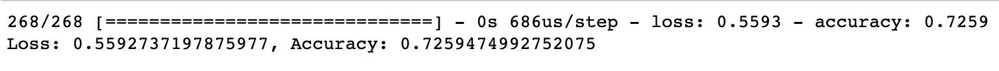
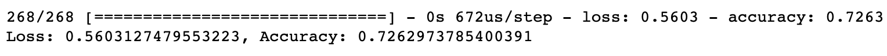
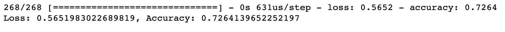
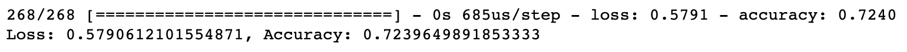

# 19-Neural_Network_Charity_Analysis

## Overview of Analysis
In this project, I was tasked with building a neural network binary classifier capable of predicting whether applicants for donations will be successful if funded by Alphabet Soup. I prepared the input data, trained and evaluated the model, and finally exported the neural networks to use in any scenario.

## Results

### Data Processing
In the data given, the variable that I decided was the target based on the clients requirements was the "IS_SUCCESSFUL" column since the main objective was predicting whether a donation wold be successful or not.

Ever column outside of "IS_SUCCESSFUL", "EIN", "NAME" was used as feature because they all contained relavant information that could affect the outcome. "EIN and "NAME" weren't used because neither one of the columns contained information that would help me reach the end goal and were subseqently removed from the analysis.

### Compiling, Training, and Evaluating the Model
- Original Attempt

In my original evaluation of the model, we can sse that it failed to reach the goal 75% accuracy. In this attempt I used two layers with the first. one containg 80 neurons and the second containing 30. I used two layers because most deep learning models can get the job done with 2-3 layers. Beyond that, you run a seriuos risk of overfitting your data

### Optimization Attempts

- Attempt 1

- Attempt 2

- Attempt 3

The above images represent three of my attempts at optimizing this deep learning model. As you can see, these attempts failed at reaching the 75% accuracy mark. The differences between my attempts and original evaluation included changing the activation types, adding more layers, adding more neurons, and even trying with just one layer.

## Summary

As you can see, the deep learning model did not reach the accuracy goal which is dissappointing. Two things that I believe would increase the accuracy of this model would be either adding to the dataset that set so the model has a bigger "playing field" per say or using the random forest classifier model instead.
