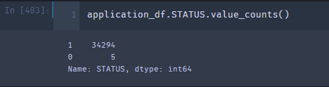

# Neural_Network_Charity_Analysis
## Overview
Alphabet Soup is a non-profit organization dedicated to protecting the environment. The Company invests in life-saving technology and the organization of reforestation groups around the world. Alphabet Soup invests in many partner companies that carry out the strategic goal of saving the environment.

In this project, we will implement a neural network binary classifier capable of predicting whether applicants for donations will be successful if funded by Alphabet Soup. We will prepare input data, design, train, evaluate, and export neural networks to use in any scenario.

### Control Flow
1. Data Preprocessing
2. Feature and Target Selection
3. Splitting the dataset to train and test
4. Fitting and predicting with he model
5. Evaluating model performance
6. Evaluate Feature importance (Depending on model)
7. Optimize model based on Feature Impotance or other model parameters or features
## Results
### Data Processing
1. Feature List

2. Columns to be dropped.

The EIN and the Name column are non-beneficial to the model thus we remove them. Similarly, the STATUS column contains more than 98% the same value; the inclusion or exclusion of this column does not improve or decrease model performance
STATUS

### Compiling, Training, and Evaluation
To optimize the model, we used three hidden layers, with 90, 50, and 25 neurons for layer1, layer2, and layer3 respectively
#### Attempt 1: Dropping more columns
To increase model performance, we started by dropping more columns. Any columns dropped beyond the NAME, EIN, and STATUS colums either reduced model performance or did not increase model performance or did.

Model Accuarcy after dropping more columns

#### Attempt 2: Creating more bins for rare occurrences of categorical variable
A second attempt at improving model performance was creating more bins for the APPLICATION_TYPE and CLASSIFICATION columns. This attempt had no impact by themseleves on model performance.

Model Accuracy after binning rare categorical occurences

#### Attempt 3: Incarease number of neurons
A third attempt at improving performance was increasing the number of neurons in the hidden layer. This attempt did not increase model accuracy

Model Accuracy after increasing number of neurons

#### Attempt 4: Incrase number of hidden layer and changing activation functions
A fourth attempt included incrasing number of hidden layers and changing activation functions. Individually, these attempts did not raise model accuracy beyond 72%

Model Peformance after increasing number of hidden layers

#### Attempt 5: Using a different model: Random Forest
Random forests or random decision forests are an ensemble learning method for classification, regression, and other tasks that operate by constructing many decision trees at training time. For classification tasks, the output of the random forest is the class selected by most trees.

With Random Forests, we can compute feature importance which can be used to determine the most important features. We can then focus on these features to determine if our model accuracy improves.
After multiple tries with different feature combinations, we can determine that the CLASSIFICATION feature is a particularly noisy column. Also, the ASK_AMT column contains a lot of outliers. Removing some of the outliers together with some CLASSIFICATION records improved model performance to 75%

### Summary
While the neural network model may be a robust machine learning algorithm, it did not do an excellent job at classifying which applicant's requests for donation will be successful given the dataset we have.
Some of the steps to improve model accuracy may include:
1. One recommendation is to use a larger dataset to train the neural network model to learn the general distribution of the dataset without overfitting.
2. We may use the Balanced Random Forest Classifier, which combines the decision of multiple trees to create a strong model accuracy

While model accuracy reached 75%, we may have a model that is overfitting. That is why a larger dataset will be appropriate to train our neural network model or any other model we choose to use.
